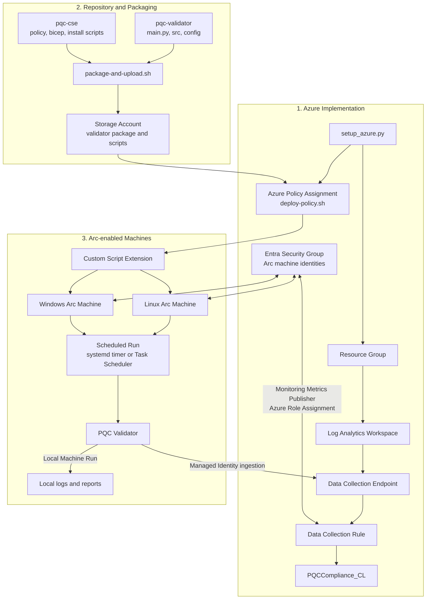

# PQC Accelerator

Post-Quantum Cryptography (PQC) is a new generation of cryptographic algorithms designed to protect data from attacks by future quantum computers. Unlike current encryption methods such as RSA and ECC, PQC remains secure against both classical and quantum computing attacks. It can be deployed through software updates without requiring specialized hardware, making it practical for existing systems. Organizations are adopting PQC now to protect sensitive data from "harvest now, decrypt later" threats. As quantum computing advances, PQC will become a critical component of modern cybersecurity.

This accelerator was built to help understand gaps and compliance with PQC requirements.

## What This Project Delivers

- Cross-platform post-quantum cryptography validation for Arc-enabled machines (Linux, Windows).
- Azure Log Analytics ingestion for fleet observability.
- Arc fleet deployment support through Custom Script Extension and Azure Policy.
- Individual machine scanning with output and compliance gap reporting.

## Repository Layout

```text
pqc_accelerator/
├── README.md              # Single authoritative guide (this file)
├── pqc-validator/         # Core validator application
│   ├── main.py
│   ├── requirements.txt
│   ├── requirements-arc.txt
│   ├── config/
│   ├── deploy/
│   │   ├── setup_azure.py
│   │   └── arc_orchestrator.py
│   │   └── arc_mi_secgroup.sh
│   └── src/
└── pqc-cse/               # Arc Custom Script Extension(CSE) and Policy deployment assets
    ├── package-and-upload.sh
    ├── deploy-policy.sh
    ├── linux/install.sh
    ├── windows/install.ps1
    ├── bicep/
    └── policy/
```

## Required Infrastructure for PQC Validator

Use this section as the baseline infrastructure checklist.

### Minimum

1. Azure subscription with permission to create:
   - Resource group
   - Log Analytics workspace
   - Data Collection Endpoint (DCE)
   - Data Collection Rule (DCR)
   - Custom table for PQC data
2. Arc-connected machines (Linux and/or Windows) with:
   - Connected status
   - System-assigned managed identity enabled
3. Storage account for deployment package artifacts used by CSE rollout.

## Data Flows

1. Azure Implementation using ```setup_azure.py``` to create Azure infrastructure
2. Repository and Packing in the Azure Storage Account for the custom script extension and validator for Windows and Linux
3. Arc-Enabled Machine implementation and interaction with the Azure Policy. Arc-enabled machines can also be manually run locally.



1. `setup_azure.py` provisions the monitoring resources used by the validator.
2. `package-and-upload.sh` publishes the validator package and bootstrap scripts to storage.
3. `deploy-policy.sh` assigns Azure Policy so Arc machines receive the Custom Script Extension.
4. The extension installs the validator and configures scheduled execution on Linux or Windows.
5. Each validation run writes local output and sends normalized records into `PQCCompliance_CL` through the DCR pipeline.

### Identity and Access

1. Create one Microsoft Entra security group for Arc machine identities.
2. Add each Arc machine identity (service principal) to that group. Use the bash script in the deploy folder ```arc_mi_secgroup.sh```. NOTE ensure that you update the security group object id on row 8.
3. Assign ingestion permissions at the monitoring scope once (for the group), then onboard machines by group membership.

This model is more portable than per-machine manual role assignments and scales for peer review and production rollout.

## Deployment Modes

### Mode A: Local or Single Host Validation

Use this for development, testing, and peer review demonstrations.

1. Install Python and dependencies.
2. Run validator.
3. Review logs and reports.

```bash
cd pqc_accelerator/pqc-validator
python3 -m venv venv
source venv/bin/activate
pip install -r requirements.txt
python3 main.py
```

Output directories:

- logs
- reports

### Mode B: Arc Fleet Validation with Central Logging

Use this for portable fleet rollout.

#### Step 1: Provision Azure monitoring infrastructure

```bash
cd pqc_accelerator
python3 pqc-validator/deploy/setup_azure.py \
  --subscription <subscription-id> \
  --resource-group <resource-group> \
  --location <azure-region> \
  --workspace-name <log-analytics-workspace-name>
```

Expected output:

- Creates or updates Azure monitoring resources.
- Generates .env.pqc containing DCE and DCR values.

#### Step 2: Package and publish CSE artifacts

```bash
cd pqc_accelerator/pqc-cse
chmod +x package-and-upload.sh
./package-and-upload.sh \
  --storage-account <storage-account-name> \
  --resource-group <resource-group> \
  --subscription <subscription-id>
```

Expected output:

- Uploads validator package and install scripts.
- Generates pqc-cse/.env.cse with artifact URLs.

#### Step 3: Deploy at scale with Azure Policy

```bash
cd pqc_accelerator/pqc-cse
chmod +x deploy-policy.sh
./deploy-policy.sh \
  --subscription <subscription-id>
```

Optional scope controls:

- `--management-group <management-group-id>`
- `--scope-rg <resource-group>`

#### Step 4: Verify operation

1. Confirm extension deployment on Arc machines.
2. Confirm scheduled execution on Linux and Windows nodes.
3. Query Log Analytics table for incoming records.

Example query:

```kusto
PQCCompliance_CL
| where TimeGenerated > ago(24h)
| summarize TotalRecords = count() by RecordType_s, MachineName_s
| order by TotalRecords desc
```

## Web App Customized Dashboard

There is a web interface that was provisioned, it can be found in the ```webapp``` folder. You can chose to run it locally, ```dotnet run``` or publish to an AppService. Its a .NET application with a React front-end.
Ensure you update the ```appsettings.json``` with the workspace ID from your Log Analytics Workspace.

## Portability Guidelines

1. Keep all commands parameterized with placeholders.
2. Never commit generated environment files with secrets or SAS tokens.
3. Prefer scripted setup from this guide over ad-hoc terminal history.
4. Use one reviewer path:
   - Provision infra
   - Package artifacts
   - Assign policy
   - Validate ingestion

## Cleanup and Legacy Removal Applied

This project section was cleaned for portability and review clarity:

- Legacy status and one-off deployment markdown files removed.
- Redundant multi-file markdown documentation removed.
- Generated environment files from previous deployments removed.
- Root ignore rules added to prevent accidental recommit of generated deployment artifacts.

## Known Operational Notes

1. Policy evaluation and remediation are not instantaneous; allow time for assignment and compliance cycles.
2. Identity and RBAC propagation can take several minutes after group membership changes.
3. Use scoped policy assignment during peer review to avoid broad unintended rollout.

## Troubleshooting

1. Check logs of the CSE for any errors, log locations:

- Windows
  - CSE Log ```C:\Packages\Plugins\Microsoft.Compute.CustomScriptExtension\1.10.22\status\0.status```
  - PQC Log ```C:\pqc-validator\logs```

- Linux
  - CSE Log
  - PQC Log

## Peer Review Checklist

1. Run local validator successfully on at least one platform.
2. Execute setup_azure.py in a non-production subscription.
3. Confirm .env.pqc was generated with non-empty values.
4. Execute package-and-upload.sh and confirm .env.cse generation.
5. Execute deploy-policy.sh and verify remediation tasks created.
6. Validate records appear in PQCCompliance_CL.
